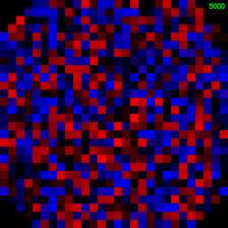

# MNIST handwritten digits classifier
Handwritten digits classifier using a fully-connected neural network implemented in JavaScript and trained using the [MNIST database of handwritten digits](http://yann.lecun.com/exdb/mnist/).

## Usage
- `git clone https://github.com/Firlej/MNIST-image-classifier`
- `cd MNIST-image-classifier`
- `gunzip data_train.js.gz data_test.js.gz data_min.js.gz`

## Structure
It's all written in pure JavaScript without any libraries except the one I developed myself [oskar.js](https://github.com/Firlej/oskar.js/). The library constains a `Matrix` class, which has all the essential methods, a neural network needs. On top of that I built `Layer` class which in turn is used by the `NeuralNetwork` class that wraps all the structures.

## Initialising the neural network
I've implemented the neural network so you specify any number of hidden layers, with any number of neurons in each layer.
```js
let nn  =  new  NeuralNetwork(784, [40, 40], 10);
```
There are three parameters. The number of input neurons, an array of numbers which represent the number of neurons for each hidden layer, and the number of output neurons.

## Visualisation of the NN learning
<!-- https://media.giphy.com/media/gKZwncNW8wahE14z63/giphy.gif -->


Visualisation of the net learning. Weights are being constantly improved and the network's accuracy reaches ~96% after training.

## Weights of a single neuron in the first hidden layer
<!-- https://media.giphy.com/media/fsu9Z8Wc9jX3qEZt5Z/giphy.gif -->


This gif visualises the weights between the input layer and one of the neurons in the first hidden layer.

## Acknowledgements
- [https://natureofcode.com/book/chapter-10-neural-networks/](https://natureofcode.com/book/chapter-10-neural-networks/)
- [https://blog.zhaytam.com/2018/08/15/implement-neural-network-backpropagation/](https://blog.zhaytam.com/2018/08/15/implement-neural-network-backpropagation/)
- [https://github.com/cazala/mnist/](https://github.com/cazala/mnist/)
